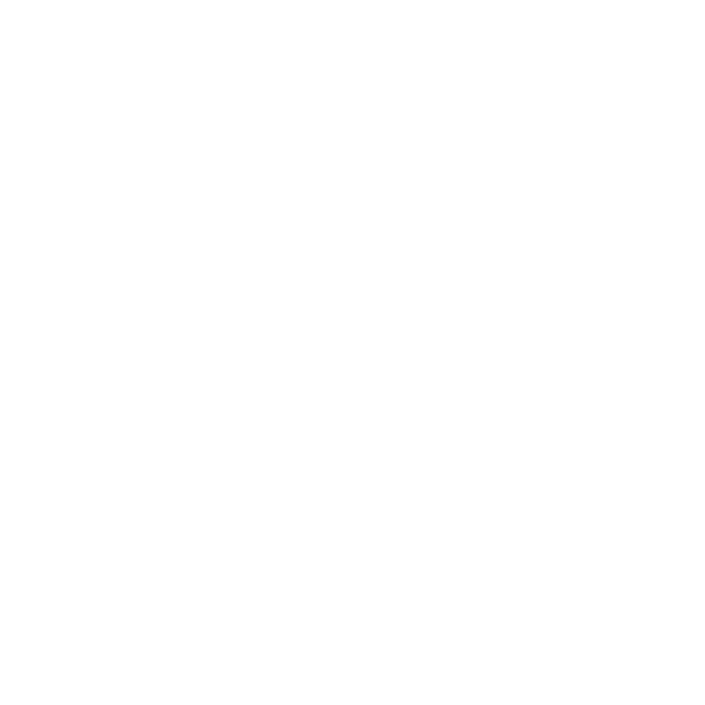

# Usoris Nexus

Usoris Nexus is your go-to solution for all things frontend development. Whether you're seeking UI inspiration, frameworks, UI library links, or comprehensive guides, Usoris Nexus has got you covered.

## Features

- **UI Inspiration:** Explore a curated collection of stunning UI designs to spark your creativity.
- **Frameworks:** Discover and compare various frontend frameworks to choose the one that best fits your project.
- **UI Library Links:** Access a comprehensive list of UI libraries, making it easy to integrate pre-designed components into your applications.
- **Guides:** Dive into detailed guides covering a wide range of frontend development topics to enhance your skills.

## Tech Stack

**Client:** NextJs, TailwindCSS, Framer

## Contributing

Contributions are always welcome!

See `contributing.md` for ways to get started.

Please adhere to this project's `code of conduct`.

## Badges

Add badges from somewhere like: [shields.io](https://shields.io/)

## Issues you can work on :

1. Create a Contribution.MD file
2. Create Cards which will redirect to the framework main page or the utility library page
3. Create your blog section for frontend developers
4. Modify this READme.MD
5. Work on the Figma UI for this website

## Feedback

If you have any feedback, please reach out to us at rummanfardeen4567@gmail.com

